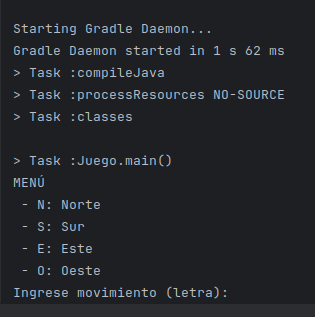
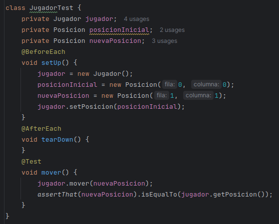
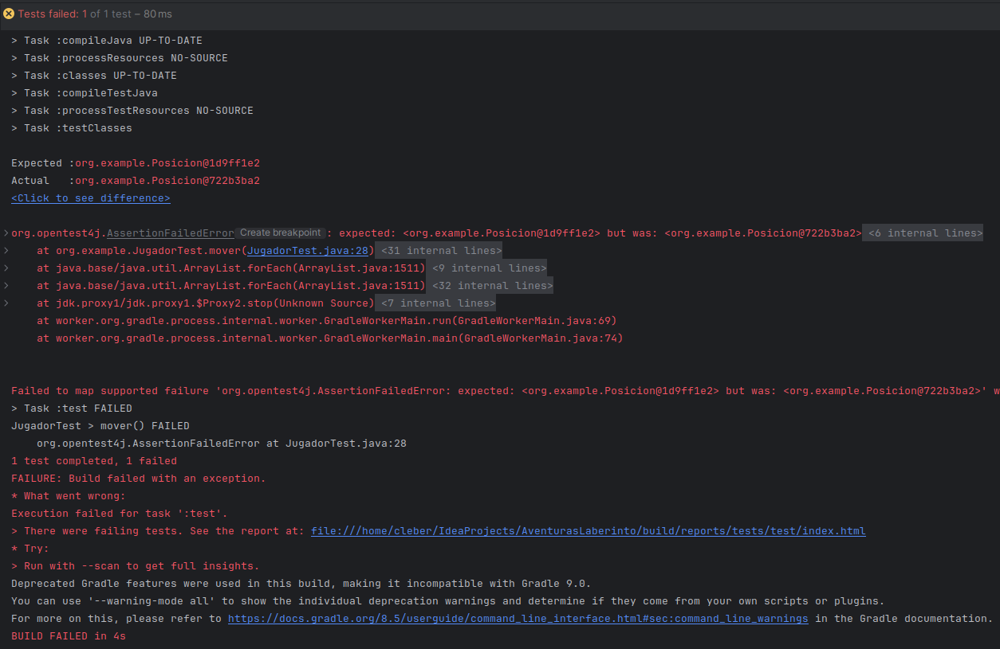
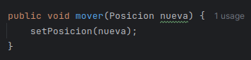
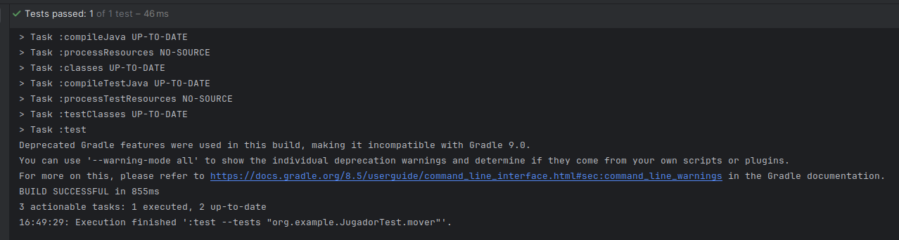

# Contrucción BÁSICA
clases según lo indicado sin implementar funcionalidades del juego. Solo se incluyen getters y setters. Se le añade la clase Posicion con funcionalidades simples de contrucción para un mejor manejo.
```java
//getters y setters obviados
public class Posicion {
    private int fila;
    private int columna;
    public Posicion(int fila, int columna) {
        this.fila = fila;
        this.columna = columna;
    }
}
public class Jugador {
    private Posicion posicion;
    private int puntaje = 0;
    private int vida = 3;
    public void mover(Posicion nueva) {
        //********** funcionalidad **********
    }
    public void actualizarPosicion(Posicion nueva) {
        //********** funcionalidad **********
    }
    public boolean verificarColision(Posicion nueva) {
        //********** funcionalidad **********
        return false;
    }
}
public class Laberinto {
    private final int TAMANO = 10;
    private char[][] tablero;
    public void iniciar() {
        //********** funcionalidad **********
    }
    public void mostrar() {
        //********** funcionalidad **********
    }
    public char[][] getTablero() {
        return tablero;
    }
    public void setTablero(char[][] tablero) {
        this.tablero = tablero;
    }
}
import java.util.Scanner;
public class Juego {
    public Laberinto laberinto = new Laberinto();
    public Jugador jugador = new Jugador();
    public void iniciar() {
        //********** funcionalidad **********
    }
    public void procesarComando(char direccion) {
        //********** funcionalidad **********
    }
    public boolean verificarEstado() {
        //********** funcionalidad **********
        return true;
    }
    public static void main(String[] args) {
        Juego juego = new Juego();
        juego.laberinto.mostrar();
        Scanner in = new Scanner(System.in);
        while(juego.verificarEstado()) {
            System.out.println("MENÚ\n - N: Norte\n - S: Sur\n - E: Este\n - O: Oeste");
            System.out.print("Ingrese movimiento (letra): ");
            char direccion = in.next().charAt(0);
            juego.procesarComando(direccion);
            System.out.println("\tPOSICION ACTUAL : " + juego.jugador.getPosicion() + "\n");
            juego.laberinto.mostrar();
        }
    }
}
```
### Ejecutando: ...resultado

# Aplicar TDD
1. Escribimos el primer test para mover ... prueba falla


2. Corregimos el método `mover()`... prueba pasa

